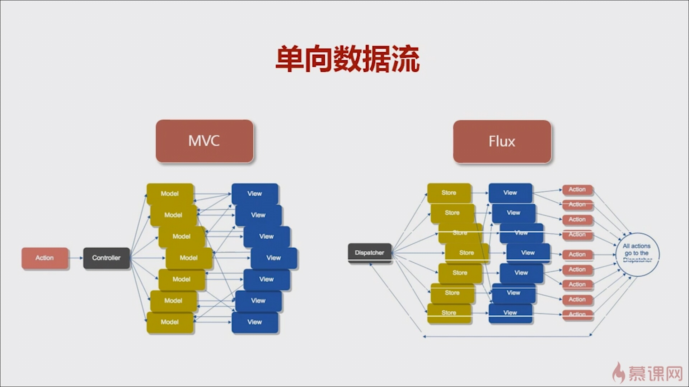
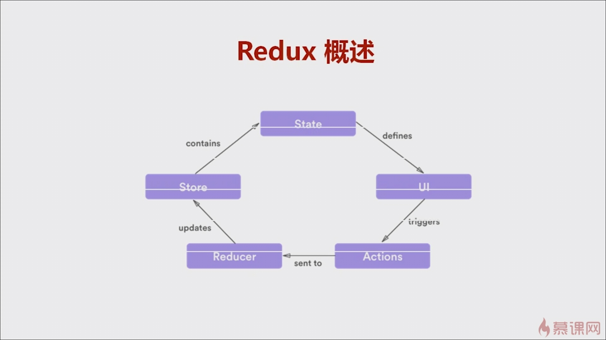
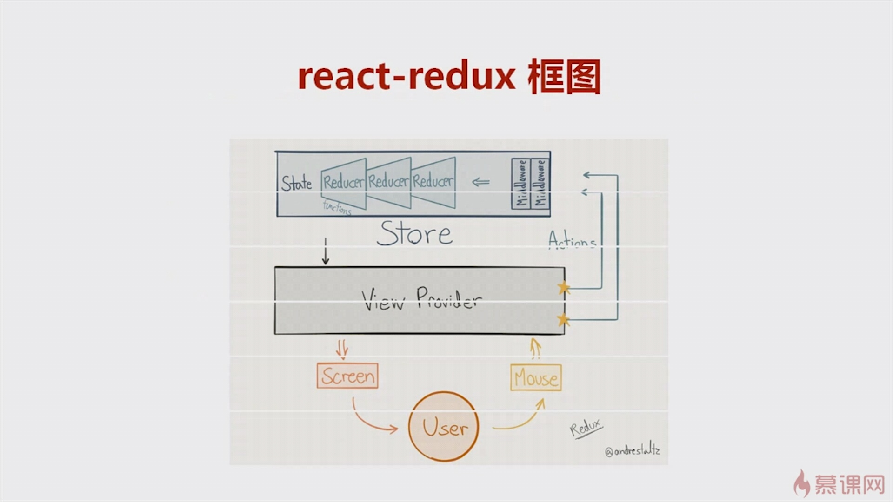
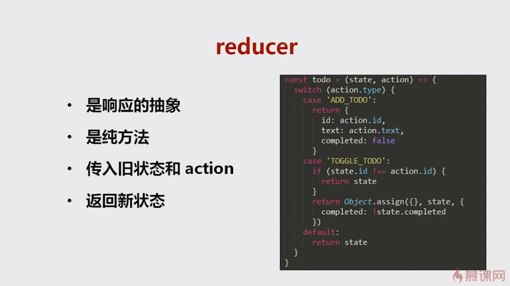
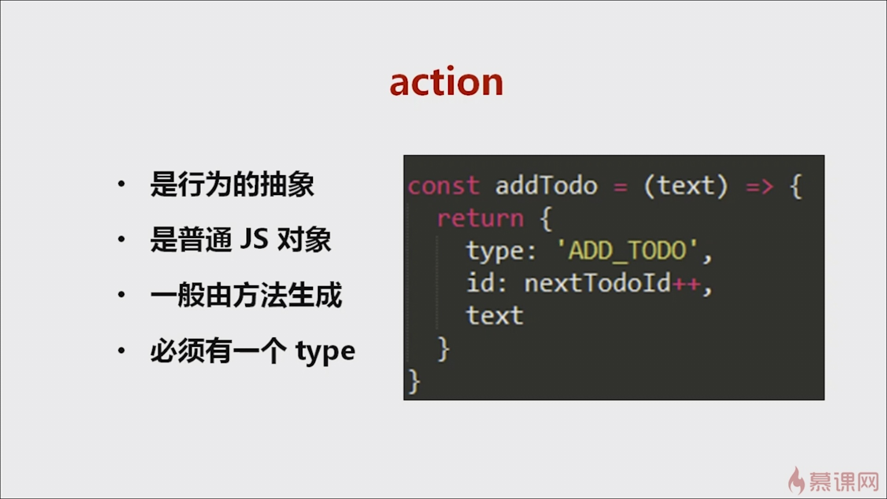
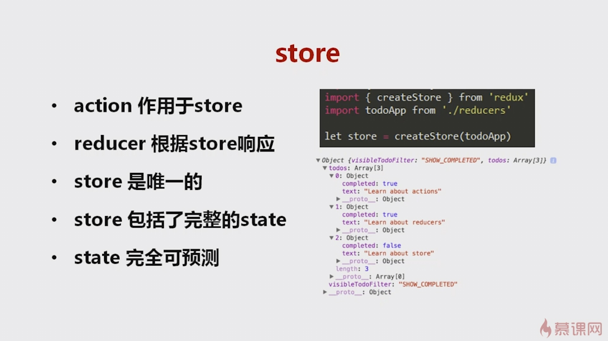
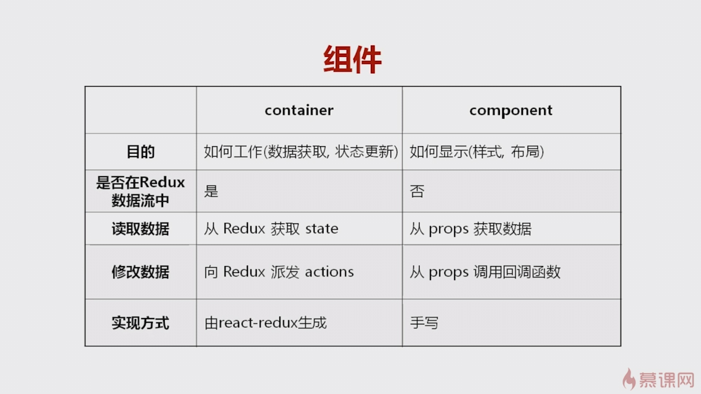

## 在react中使用redux

Flux 和 redux不同于MVC ，他是单向数据流。
通过dispatcher来分发事件

- - -
### Redux 概述
从`UI`层触发事件，`Action`被发送至`Reducer`，然后`Reducer`从而更新`Store`，`Store`包含了`State`，
跟新`State`后从而改变了`UI`，用户操作得到响应。

- - -
### react-dedux 安装

    npm i react-redux redux --save
    
- - -
### react-redux框图

- - -
### Actionn  Stroe 和 Reducer

- - -
### 组件的分类
- container
- component

他们的区别如下：

- - -
