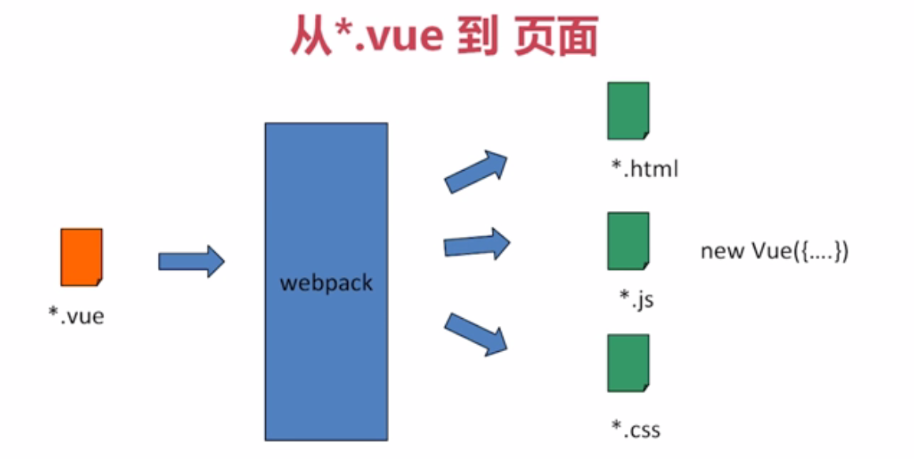
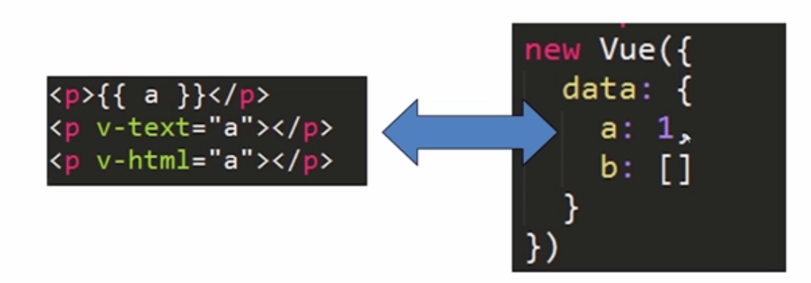
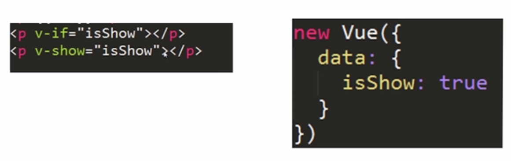
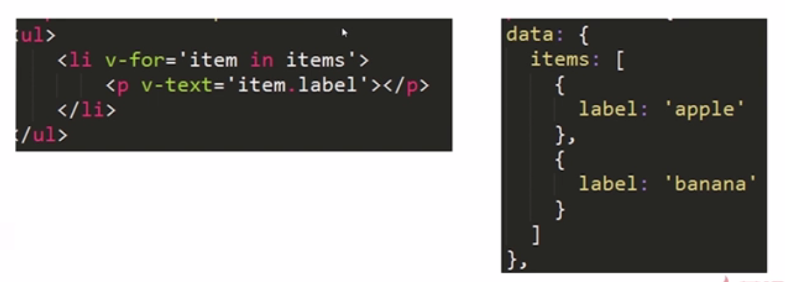
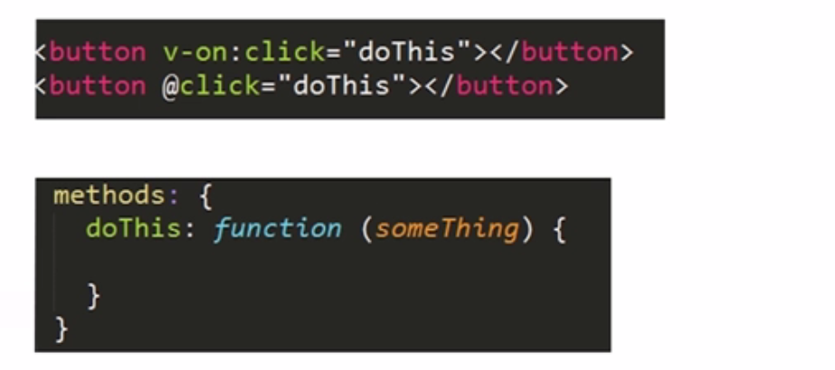
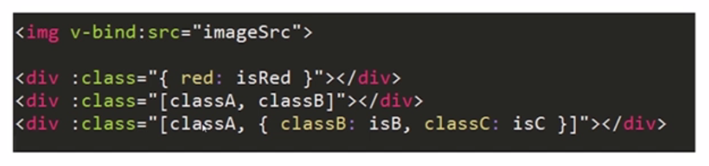

### *.vue文件内部包含:
- `<template>html<template>`
- ``
- ``

- - -
### 命令行工具

    # 全局安装 vue-cli
    $ npm install -g vue-cli
    # 创建一个基于 "webpack" 模板的新项目
    $ vue init webpack my-project
    # 安装依赖，走你
    $ cd my-project
    $ npm install
    $ npm run dev
    
- - -
### 从Vue到页面

- - - 
### Vue组件的重要选项
- data
- methods
- watch

      new Vue({
        data:{
          a:1,
          b:[]
        },
        methods:{
          dosomething:function(){
            console.log(this.a);
          }
        },
        watch:{
          "a":function(val,oldVal){
                console.log(val,oldVal);
              }
        }
      })
      
- - -
### 模板指令：HTML和Vue的粘合剂

#### 数据渲染：
- v-text
- v-html
- {{}}

#### 控制模块显示与隐藏
- v-if:直接不渲染
- v-show：通过css的display:none来隐藏

#### 渲染循环列表
- v-for

#### 事件绑定
- v-on
- @ 是v-on的简写

#### 属性绑定
- v-bind
- : 是v-bind的简写

